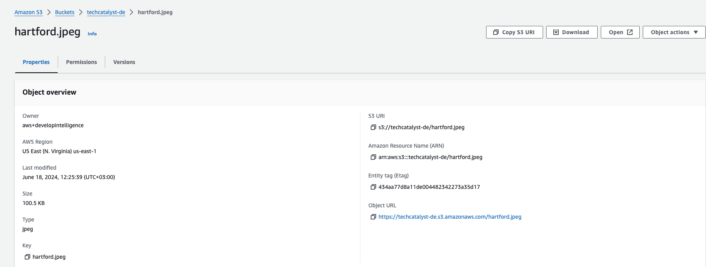
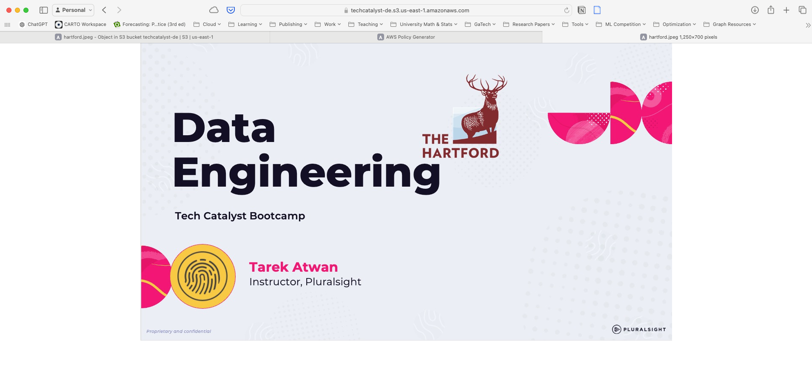
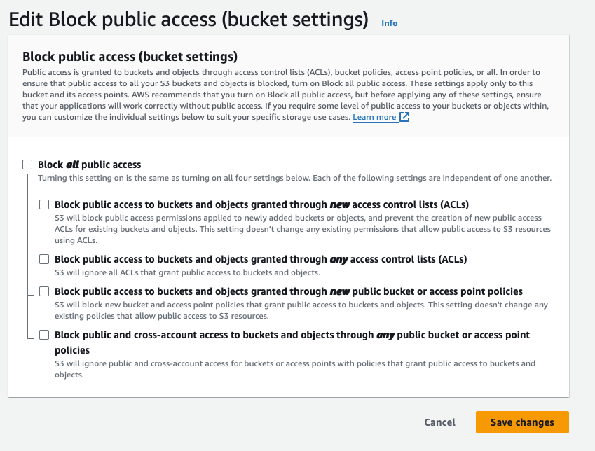
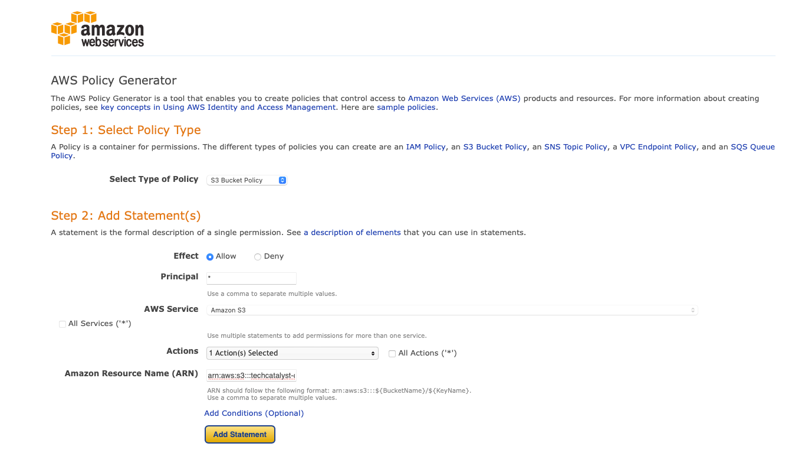
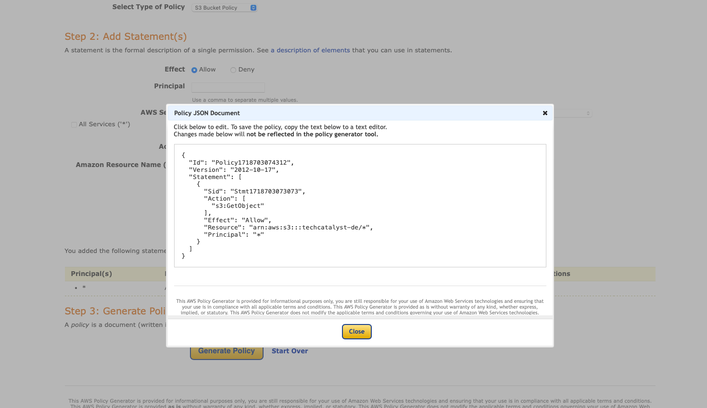
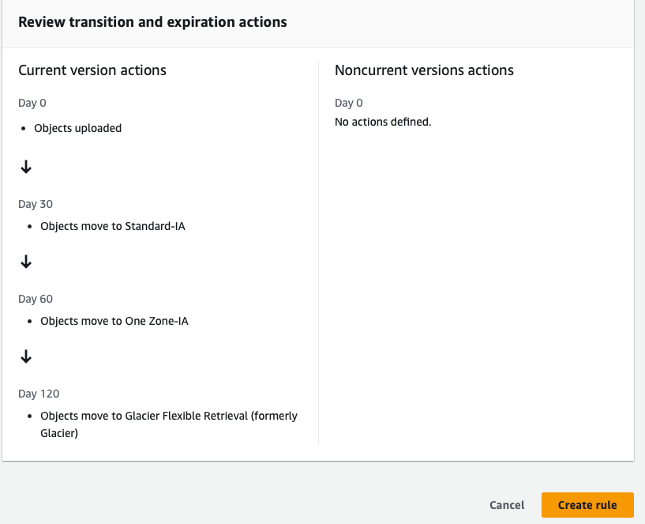
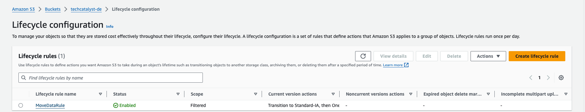
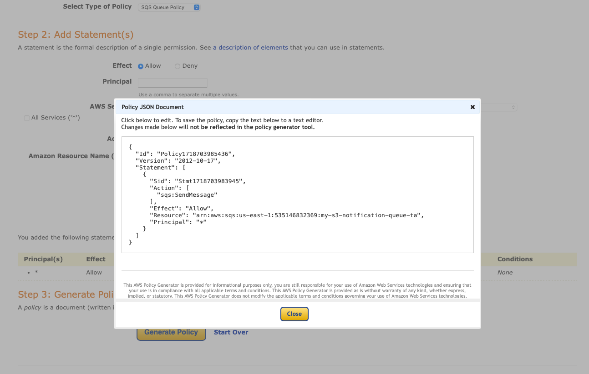

# AWS S3 Hands-On Lab

### Prerequisites:

An image file named `hartford.jpeg` and a Word document file ready `intro.docx` for upload.

### Instructions:

#### 1. Create an S3 Bucket

1. Log in to the AWS Management Console.
2. Navigate to the S3 service.
3. Click on the “Create bucket” button.
4. Enter a unique bucket name (e.g., `your-unique-bucket-name`).
5. Keep the remaining options at their default setting for now.
6. Click "Create bucket" at the bottom of the page.

#### 2. Upload the Image "hartford.jpeg"

1. Open the newly created bucket by clicking on its name.
2. Click on the “Upload” button.
3. Click “Add files” and select the `hartford.jpeg` file from your local machine.
4. Click “Upload” to upload the image. Once uploaded you can click the “Close” button on the top right corner
5. Click on the image you just uploaded and test by clicking the “Open” button

6. Test the Object URL. What do you see?

#### 3. Make the Image Public and Add a Bucket Policy

**Make the Image Public:**

1. In the bucket, click on the uploaded `hartford.jpeg` file.
2. Go to the “Permissions” tab.
3. Under “Block Public access (bucket settings),” click “Edit.”
4. Uncheck the box “Block all public access” and save changes.

5. Now test the Object URL. For example, here is mine `https://techcatalyst-de.s3.amazonaws.com/hartford.jpeg`

**Add a Bucket Policy:**

1. Navigate back to the bucket.
2. Click on the “Permissions” tab.
3. Scroll down to the “Bucket policy” section and click “Edit.”
4. Use the AWS “Policy Generator” to create a new policy:
   - Select “S3 Bucket Policy” as the type of policy.
   - Add a statement with the following details:
     - Effect: Allow
     - Principal: *
     - Action: `s3:GetObject`
     - Resource: `arn:aws:s3:::your-unique-bucket-name/*`
5. Click “Add Statement” and then “Generate Policy.”
6. Copy the generated policy and paste it into the bucket policy editor.
7. Save the bucket policy.

#### 4. Upload a Word Document and Enable Versioning

1. In the bucket, click on the “Upload” button.
2. Click “Add files” and select a Word document file from your local machine.
3. Click “Upload” to upload the document.
4. Enable Versioning for the bucket:
   - Go to the bucket's “Properties” tab.
   - Under “Bucket Versioning,” click “Edit.”
   - Enable versioning and save changes.

#### 5. Modify and Upload the Document Again

1. Make some changes to the Word document on your local machine.
2. Upload the modified document to the same bucket.
3. Ensure that you are overwriting the existing document. 

#### 6. Check the Versions

1. In the bucket, click on the “Objects” tab.
2. Enable “Show versions” by clicking the options button (three dots) on the right.
3. You will see multiple versions of the Word document.

#### 7. Create a Delete Marker and Restore the Word Document

1. In the bucket, click on the “Objects” tab.
2. Click on the “intro.docx” file and click “Delete “. Confirm the delete.
3. The delete marker will be created.
4. Verify that the file is no longer visible under the “Objects” tab.
5. To restore the document, delete the delete marker:
   - Select the delete marker version and delete it.
6. Validate that the file is restored. 

#### 8. Create a Lifecycle Rule

1. Go to the bucket's “Management” tab.
2. Click on “Create lifecycle rule”
3. Enter a rule name (e.g., “MoveDataRule”).
4. Choose the scope of the rule (e.g., apply to the entire bucket).
   1. For example, Select “Apply to all objects in the bucket”
5. Navigate to the “Lifecycle rule actions”
   1. Which option would you be selecting 
6. Add transitions:
   - Transition to Standard-IA after 30 days.
   - Transition to One Zone-IA after 60 days.
   - Transition to Glacier after 120 days.
7. Configure expiration if needed.
8. Review and create the rule.

9. Once done you should see it created with a status “Enabled”

#### 9. Create Event Notification Using SQS

**Create SQS Queue:**

1. Navigate to the SQS service in the AWS Management Console.
2. Click on “Create queue.”
3. Enter a queue name (e.g., `my-s3-notification-queue-yourinitials`).
4. Leave other settings as default and create the queue.

**Create SQS Access Policy:**

1. Navigate to the SQS queue you just created.
2. Click on the “Access Policy” tab.
3. Click “Edit” under “Access policy (Permissions)”
4. Navigate to “Access Policy” section
5. Use the AWS Policy Generator to create a new policy:
   - Select “SQS Queue Policy” as the type of policy.
   - Add a statement with the following details:
     - Effect: Allow
     - Principal: *
     - Action: `sqs:SendMessage`
     - Resource: you can copy it from the original policy for example mine is this: `arn:aws:sqs:your-region:your-account-id:my-s3-notification-queue`
     - Condition: Add a condition for “StringEquals” with `aws:SourceArn` as the key and the ARN of your S3 bucket as the value.
6. Copy the generated policy and paste it into the queue policy editor.
7. Save the queue policy.

**Create S3 Event Notification:**

1. Go back to the S3 bucket.
2. Click on the “Properties” tab.
3. Scroll down to “Event notifications” and click “Create event notification.”
4. Enter a name for the notification (e.g., `S3ToSQSNotification`).
5. Select the event type (e.g., “All object create events”).
6. Choose “Send to SQS queue” and select the SQS queue you created.
7. Save the event notification.
8. Go to SQS and open the queue you just created, click the “Send and receive messages”
9. The click “Poll for messages”
10. Go, and upload another file `coffee.jpg` to that same S3 bucket and check SQS messages again. 
11. Open the message. What do you see?

This concludes the hands-on lab. Ensure all steps are completed and verified for successful execution.

## Final Clean up

* Delete the bucket you just created 
* Delete the SQS Queue you just created 
* Double check if everything has been deleted (make sure you only delete your items)