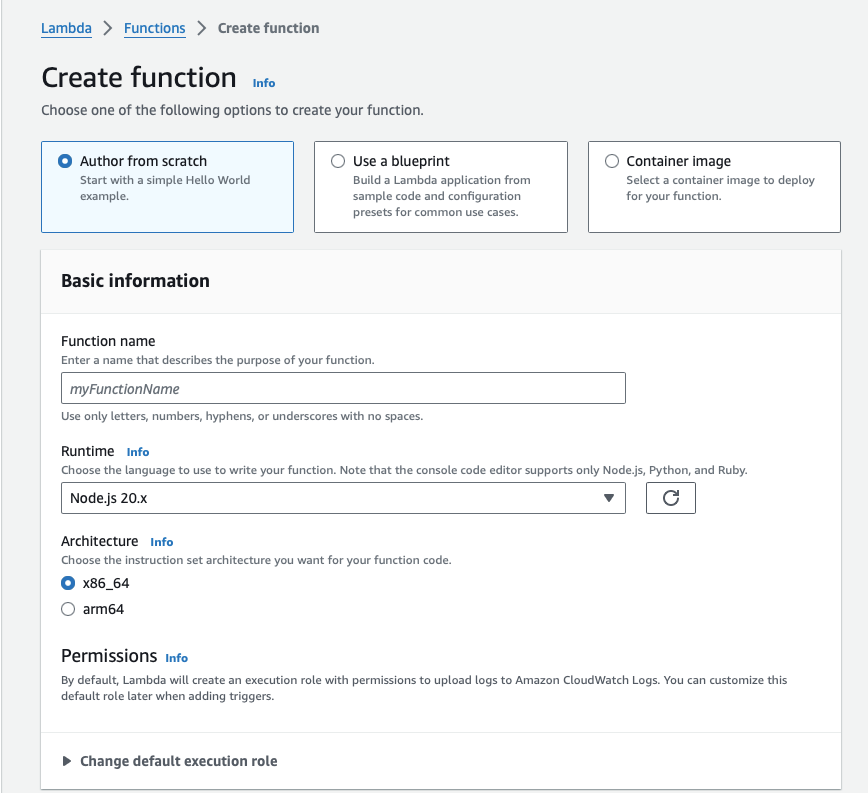
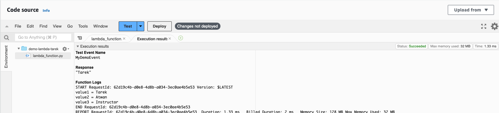
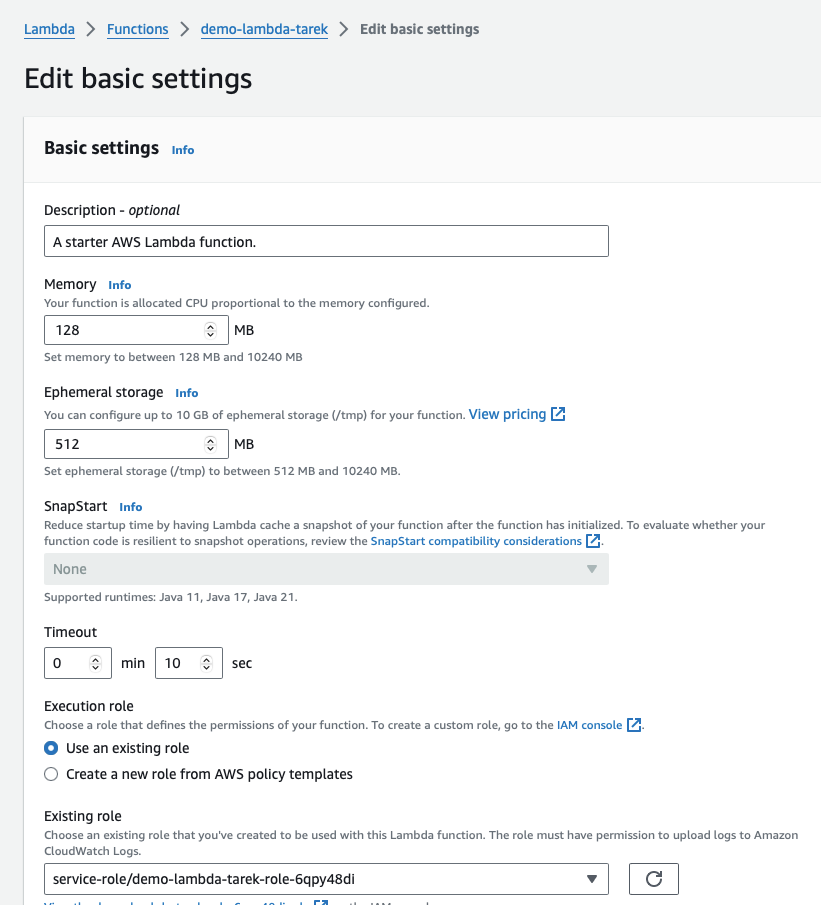

# AWS Lambda

* Create a new Lambda Function

* Select “Use a blueprint”
* In the “Blueprint name” choose Hello World the Python version 
* Name your function `demo-lambda-yourname`, for example, `demo-lambda-tarek`
* Click “Create Function”
* Configure a test event and test the function so when you hit the Test button it shows a similar output but with your information instead

* Edit the configuration settings and change the timeout to 10 seconds

* Once done, you can delete your function 