# CloudFormation Template

Before starting this EMR Serverless, you need to create the required AWS resources. To do this, we provide AWS CloudFormation template to create a stack that contains the resources. When you create the stack, AWS creates a number of resources in your account.


1. Head to AWS CloudFormation and click **Create Stack**

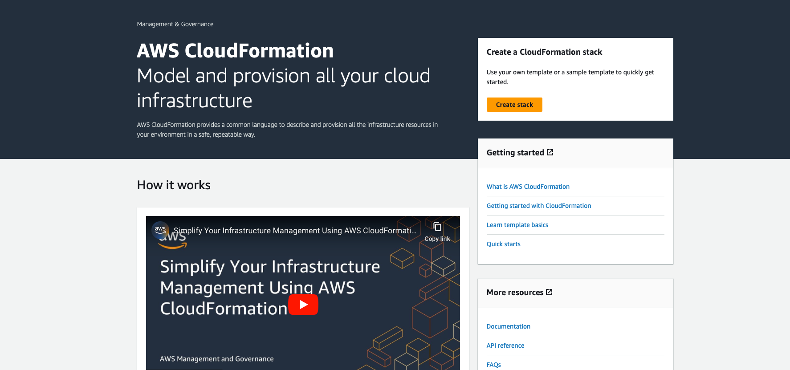

2. Template source, **Amazon S3 URL** and use the following URL

```
https://ws-assets-prod-iad-r-iad-ed304a55c2ca1aee.s3.us-east-1.amazonaws.com/e8e8fbb5-c3fb-4f86-bf77-0ba1fe402c55/emr-serverless-cfn-v2-self-paced.yml
```

As shown below

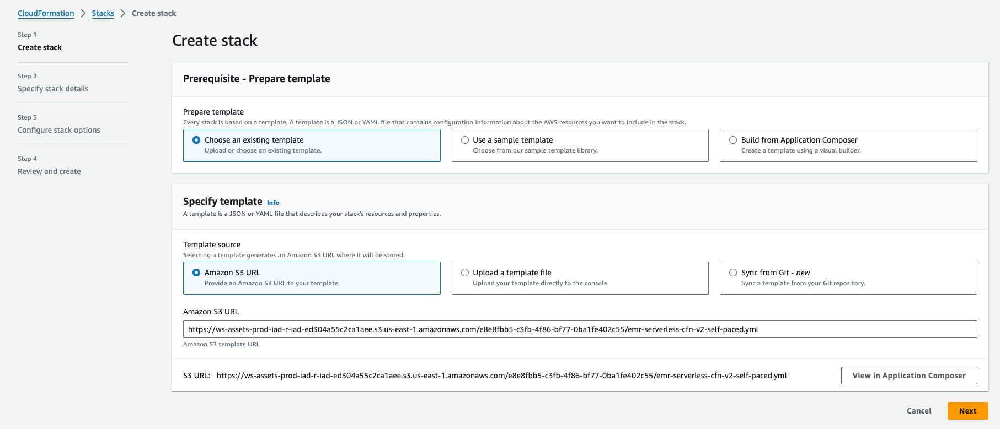

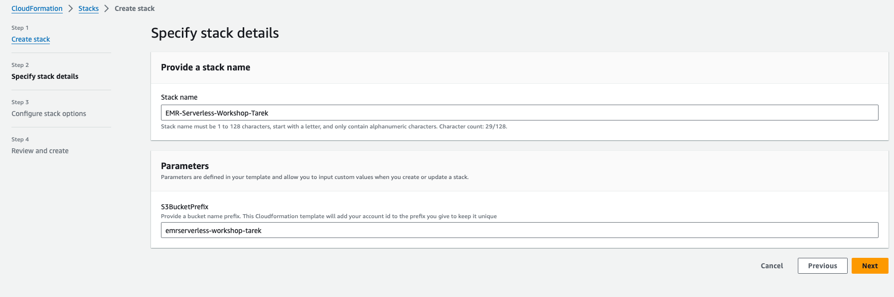

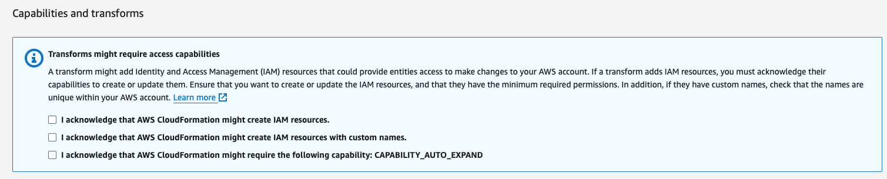

3. Keep the rest at default. Finally, check the “I acknowledge” boxes and click **Submit**

> The CloudFormation stack will roughly take 5 minutes to complete. Remember to go through the steps in the **Cleanup** section to clean the resources once you are finished. This will avoid incurring costs for the resources created as part of this workshop.

4. The CloudFormation stack will create necessary resources required for the workshop. Check the CloudFormation console and wait for the status **CREATE_COMPLETE** as shown below:

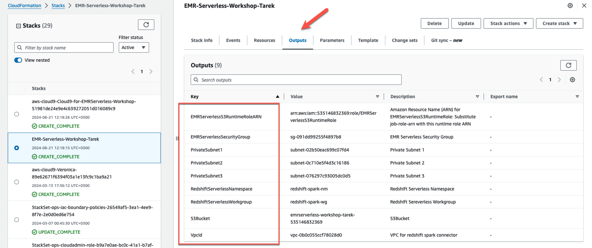

# Submit jobs to EMR Serverless

## Option 1 - Submit Spark jobs from Console

Before we submit a Job to EMR Serverless we need to create an Application. You can create one or more applications that use open-source analytics frameworks. To create an application, you specify the open-source framework that you want to use (for example, Apache Spark or Apache Hive), the Amazon EMR release for the open-source framework version (for example, Amazon EMR release 6.4, which corresponds to Apache Spark 3.1.2), and a name for your application

In AWS Console, under services search for EMR. In the EMR console select EMR Serverless, or alternatively, go to the [EMR Serverless Console ](https://us-east-1.console.aws.amazon.com/emr/serverless#/serverless)

If you are getting to the EMR Serverless console for the first time (for example, if you are performing this lab as part of an AWS Event). You will see a screen like this. Choose **Get started** . If there are existing applications choose **Manage Applications**.

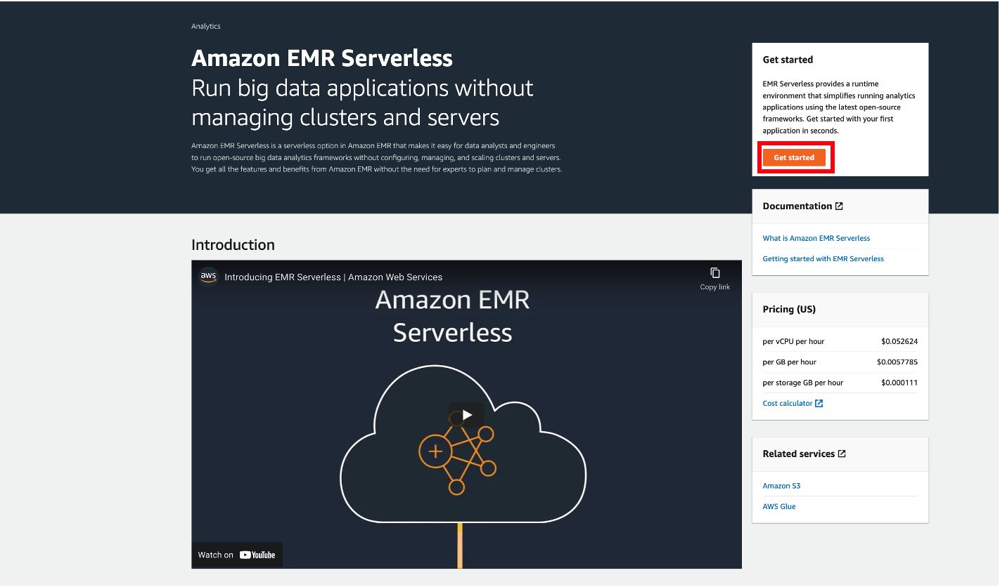

Click **Create and launch EMR Studio**.

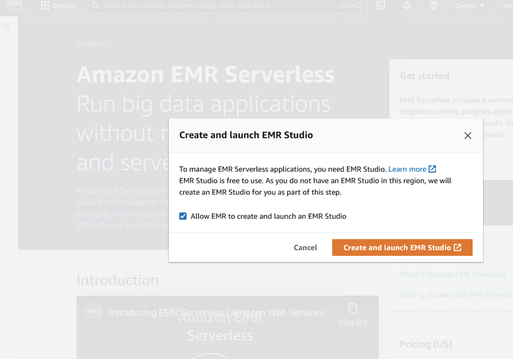

To create an EMR Serverless application, choose **Create application**

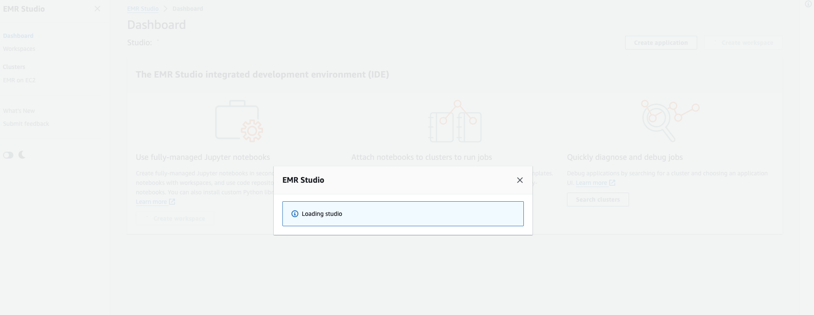

Give a name to your application. In the rest of this lab we are going to use my-serverless-application as the name of our application. Choose Spark as the Type and emr-6.7.0 as the release version. Choose default settings. Click on **Create application**

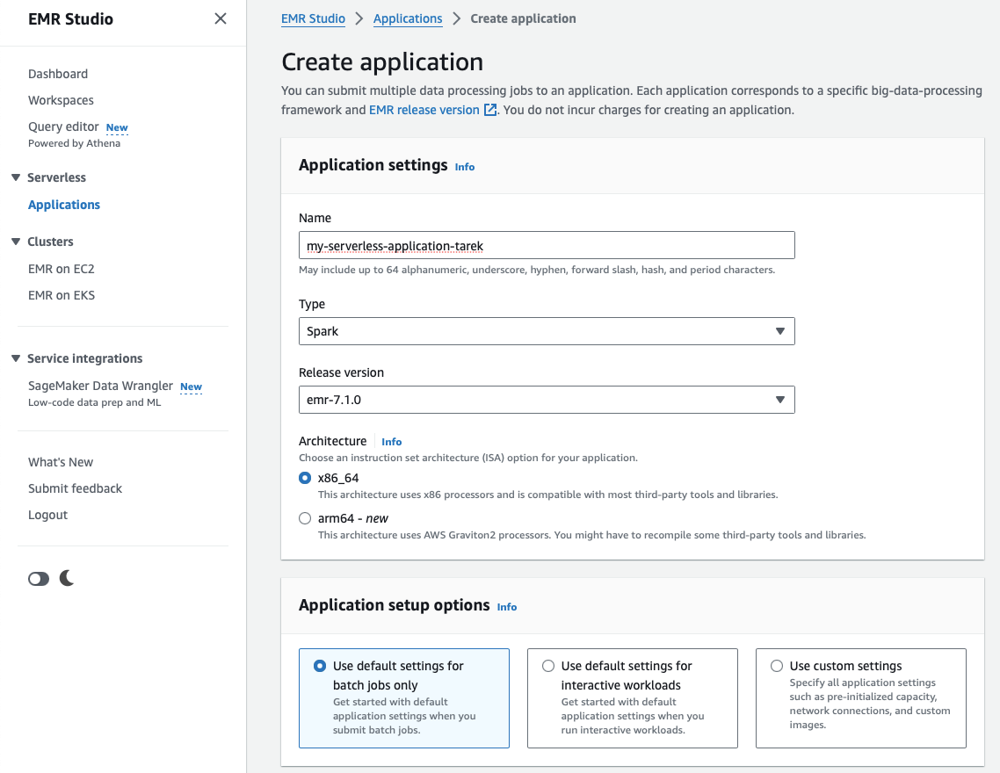

Click **Create Application**

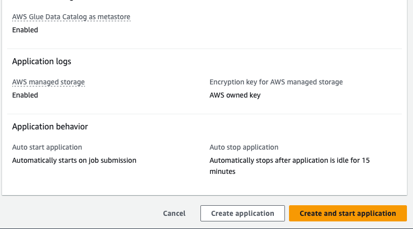

You should see the Status **Created**

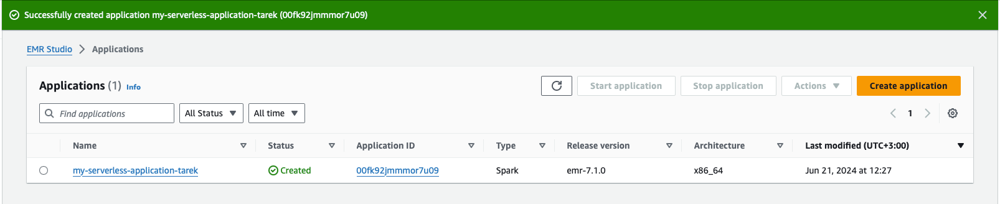

Click in your application 

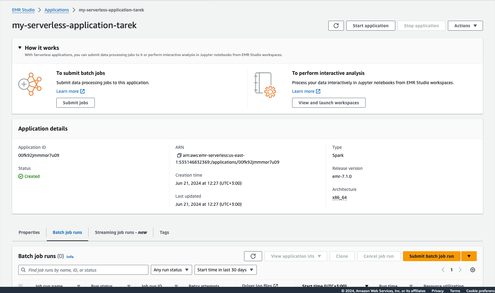

In the bottom under **Batch Job Runs** click **Submit Batch Job Runs**

> On the Submit job screen, under Runtime role you can let EMR Serverless create a role for the job, but we will use the role already created by the Cloudformation template

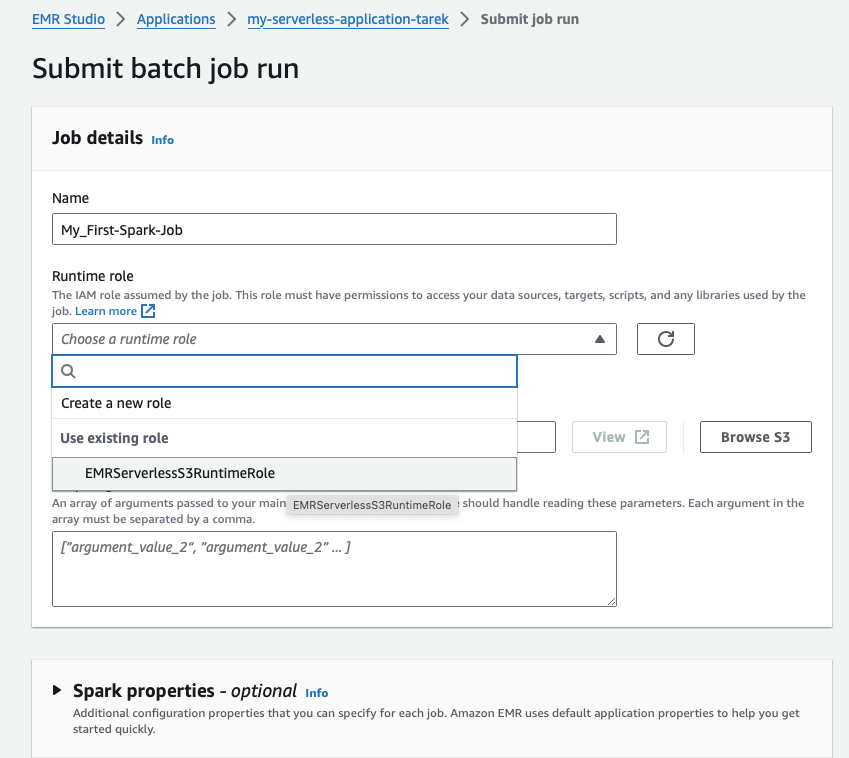

For this Lab, we have a role created by the Cloudformation template and we can use that.

In the Submit job screen enter the details as below:

|                        |                                                              |
| ---------------------- | ------------------------------------------------------------ |
| Name                   | word_count                                                   |
| Runtime role           | EMRServerlessS3RuntimeRole                                   |
| Script location S3 URI | s3://us-east-1.elasticmapreduce/emr-containers/samples/wordcount/scripts/wordcount.py |
| Script arguments       | ["s3://YOUR_BUCKET/wordcount_output/"] Replace YOUR_BUCKET with the S3 bucket name that you noted from the Cloudformation Stack Outputs Section |

For example here is my S3 bucket created for me:


Here is how I entered the information into the EMR job:


Finally click **Submit Job**

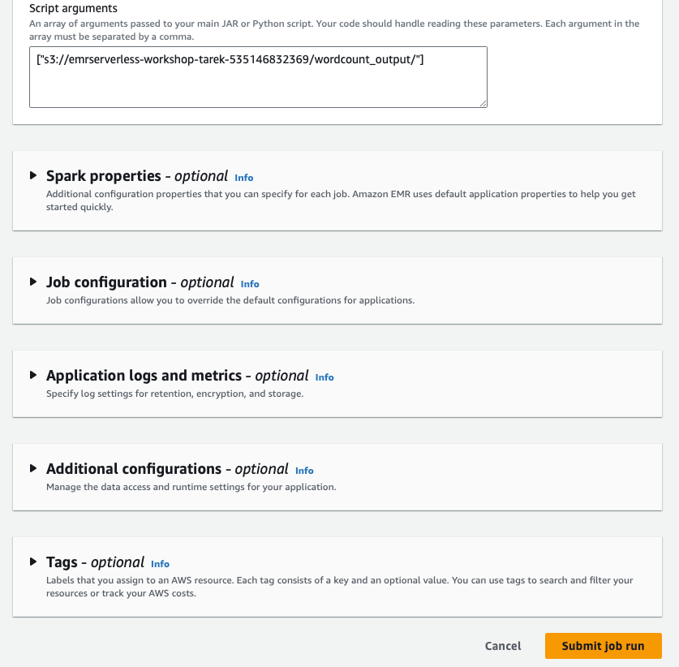

You can see that the Application status shows as *Starting* and the Job run status shows as *Pending*. First time job submissions take a little longer since the application needs to be prepared and started. Furthermore, capacity needs to be provisioned before the application becomes ready to accept jobs. If the application is already in *Started* status, jobs will start executing as and when submitted.

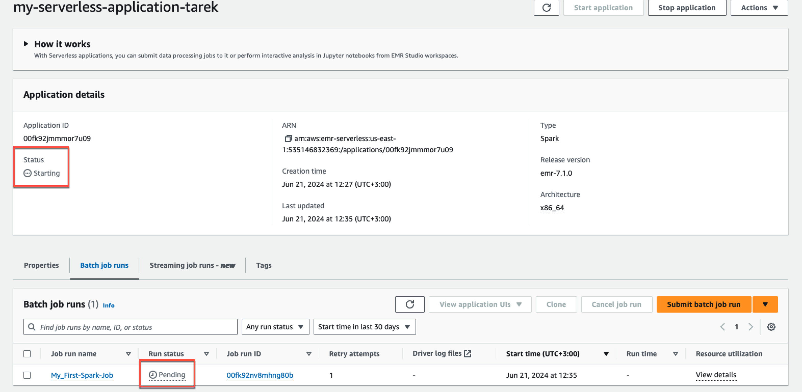

Once the job has been submitted the Run status shows *Success*.

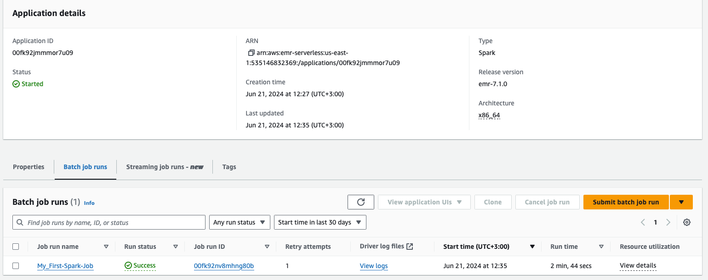


You can now verify that the job has written its output in the s3 path that we provided as an argument when submitting the job. You can go to the s3 path and see csv files successfully created by the EMR Serverless application.

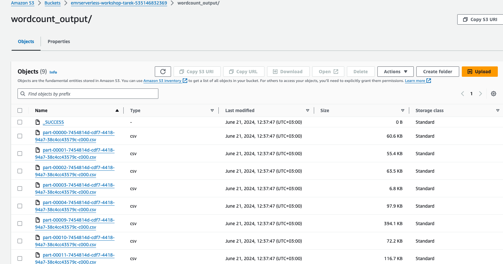


## **Challenge**

> Try your best here. This is similar to what you did yesterday.

> Use Athena to query the data from the CSV files using SQL.

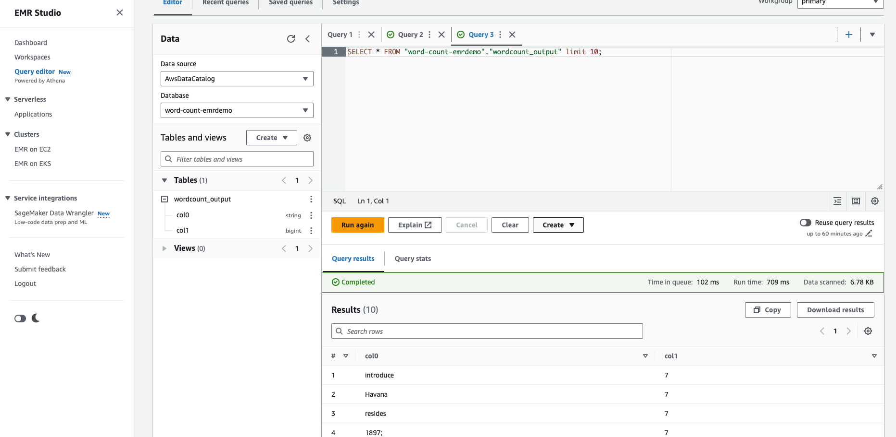


## 

## Option 2 - Submit Hive jobs using EMR Studio 

On EMR Serverless Console click on **Create application** Enter name as **hive-serverless**, Select Type as Hive and latest release version.

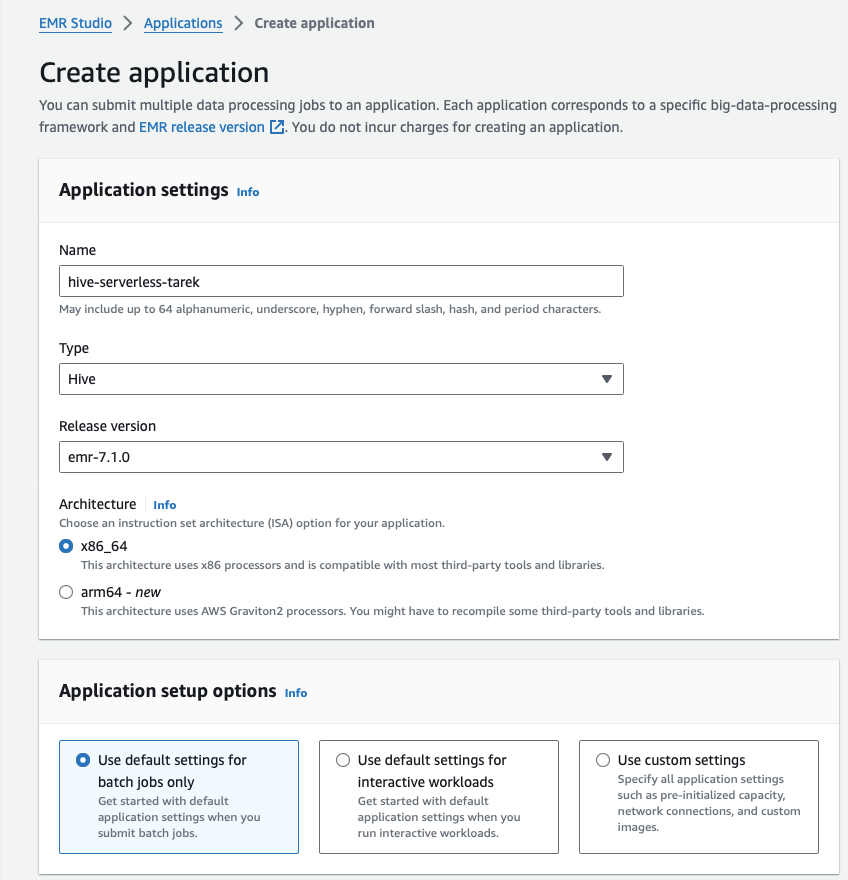

Under Application setup options, Choose default settings and click **Create application**

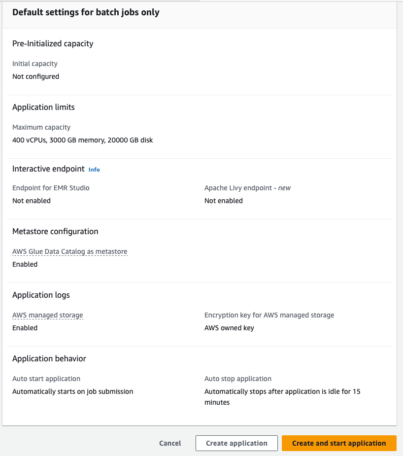

You will notice the application is created and shows Starting.

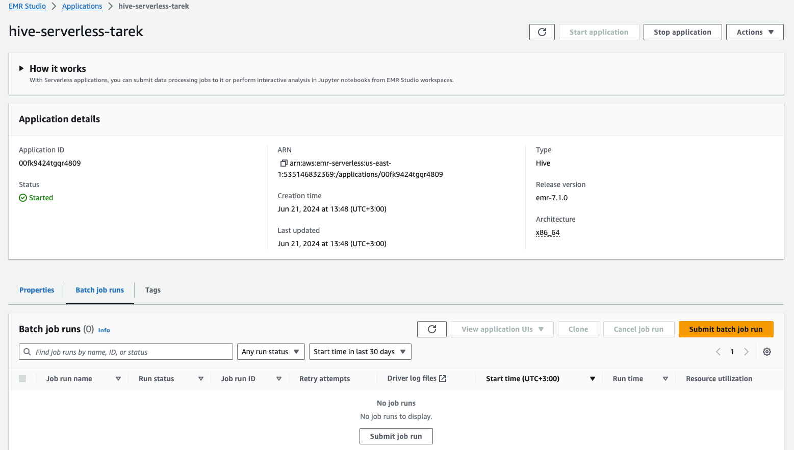

Once the application is started, we can submit Hive jobs to it. Click on **Submit job**

Enter the details as below:

|                                       |                                                              |
| ------------------------------------- | ------------------------------------------------------------ |
| Name                                  | Hive-Serverless-Console                                      |
| Runtime role                          | EMRServerlessS3RuntimeRole                                   |
| Initialization Script Location S3 URI | s3://aws-data-analytics-workshops/emr-serverless-workshop/scripts/create_taxi_trip.sql |
| Script location S3 URI                | s3://aws-data-analytics-workshops/emr-serverless-workshop/scripts/count.sql |

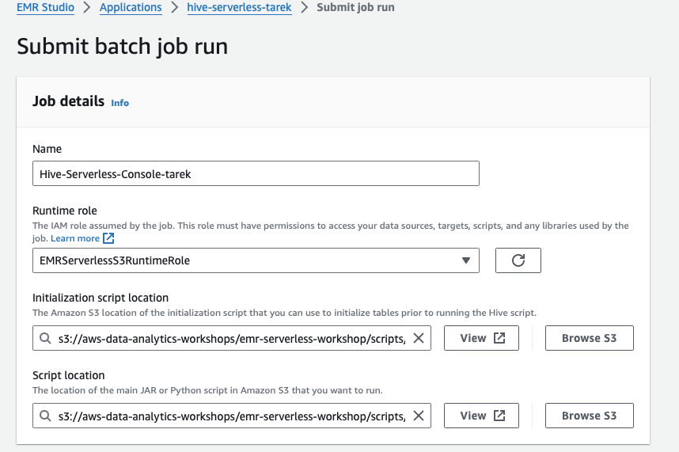

As part of the initialization script we are creating a hive table for NewYork Taxi Trip details:

```sql
CREATE EXTERNAL TABLE if not exists `nytaxitrip`(
  `vendorid` bigint, 
  `tpep_pickup_datetime` string, 
  `tpep_dropoff_datetime` string, 
  `passenger_count` bigint, 
  `trip_distance` double, 
  `ratecodeid` bigint, 
  `store_and_fwd_flag` string, 
  `pulocationid` bigint, 
  `dolocationid` bigint, 
  `payment_type` bigint, 
  `fare_amount` double, 
  `extra` double, 
  `mta_tax` double, 
  `tip_amount` double, 
  `tolls_amount` double, 
  `improvement_surcharge` double, 
  `total_amount` double, 
  `congestion_surcharge` string)
ROW FORMAT DELIMITED 
  FIELDS TERMINATED BY ',' 
STORED AS INPUTFORMAT 
  'org.apache.hadoop.mapred.TextInputFormat' 
OUTPUTFORMAT 
  'org.apache.hadoop.hive.ql.io.HiveIgnoreKeyTextOutputFormat'
LOCATION
's3://aws-data-analytics-workshops/shared_datasets/tripdata/'; 

```

Once the table is created by Hive, we want to run a count query to see the number of records in this table:

```

SET hive.cli.print.header=true;
SET hive.query.name=TaxiTrips;

Select count(*) as count from nytaxitrip;


```

Under Job configuration update the **DOC-EXAMPLE_BUCKET** with your S3 bucket name.

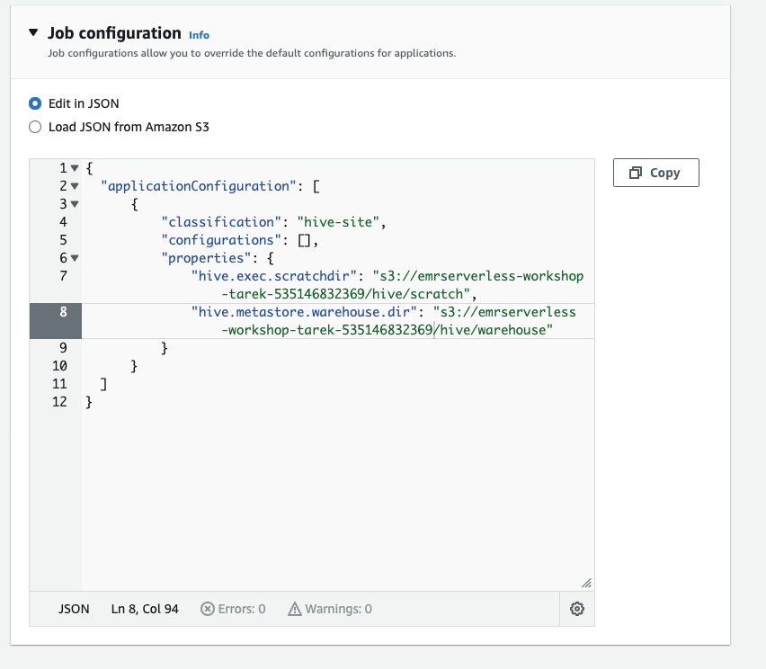

Under Additional settings select **Upload logs to your Amazon S3 bucket** and add your s3 bucket path - **<<S3_Bucket/logs>>** . We will look at the logs and monitoring in the next section and use this same job to analyze logs.

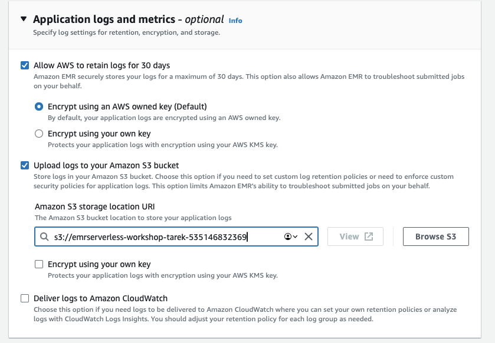

Click **Submit job**

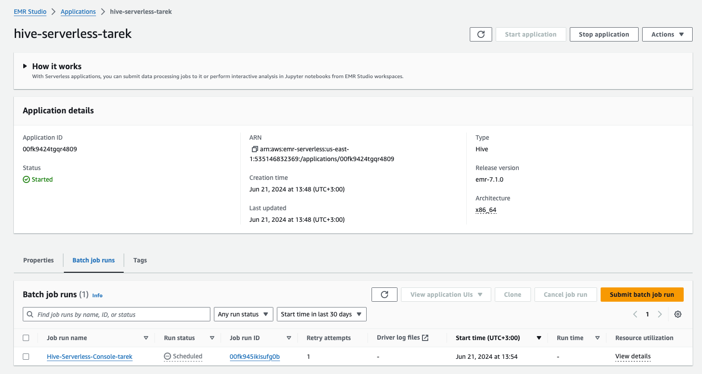

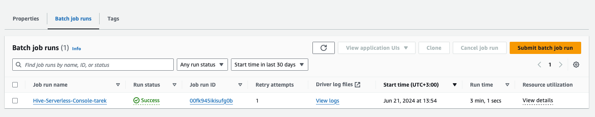

Notice the S3 bucket now contains several objects created from the applications 

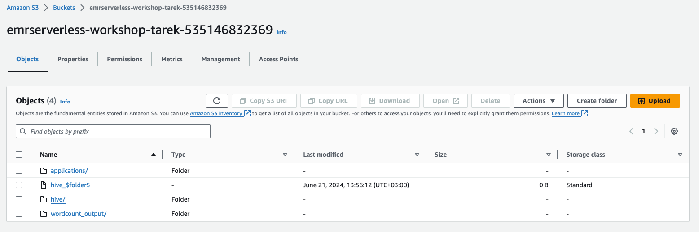


Once the job is completed successfully, go over to [Athena console ](https://us-east-1.console.aws.amazon.com/athena/home?region=us-east-1#/query-editor) to verify if the table got created and query it to check the data.

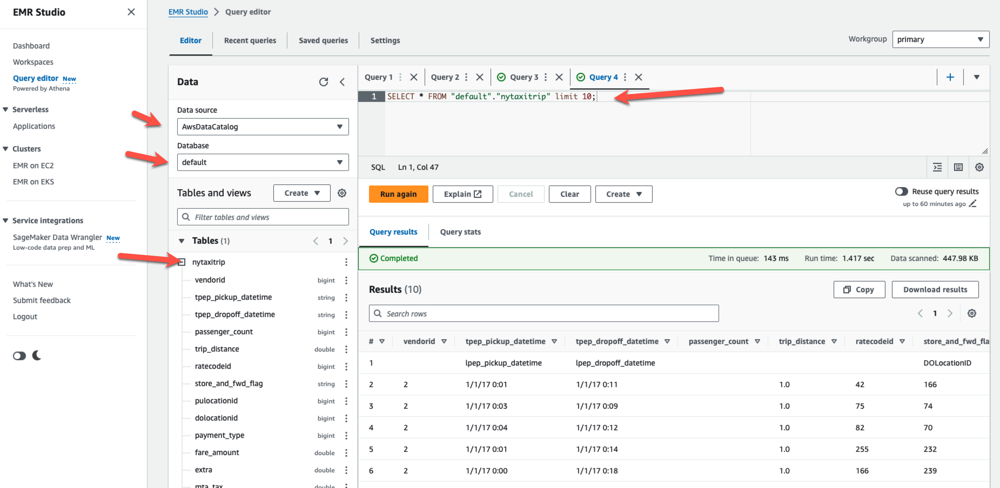


# Cleanup

When you have finished with this workshop, remember to clean up all those AWS resources that you created using AWS CloudFormation.

* Delete all the Spark/Hive applications that you created for this lab from EMR Studio/Serverless Console

Stop the applications then delete them

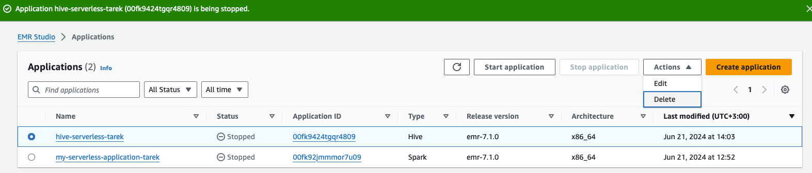

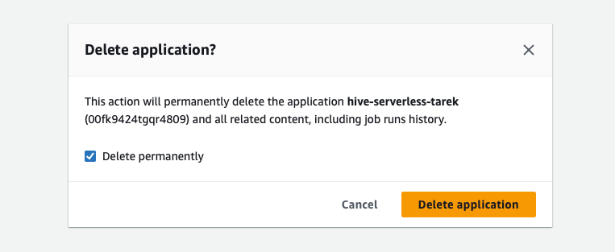

* Empty the S3 bucket 

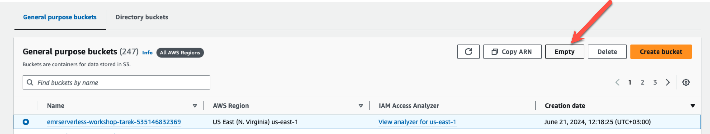


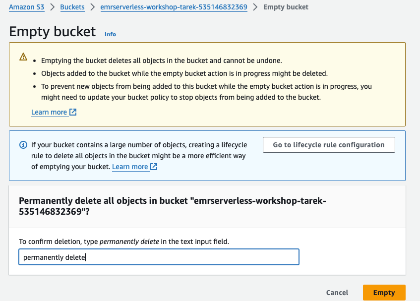


* Open up the [CloudFormation console ](https://console.aws.amazon.com/cloudformation) and select the **EMRServerless** stack and click on Delete button to terminate the stack.

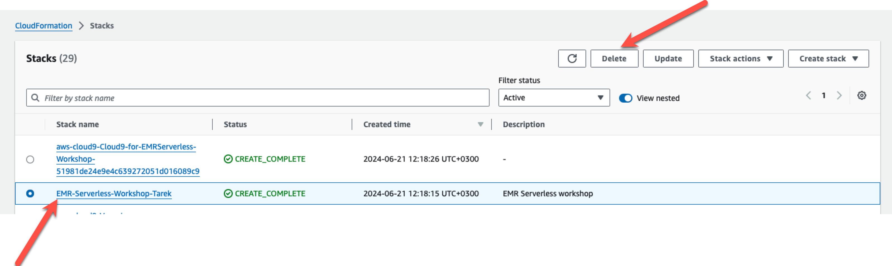

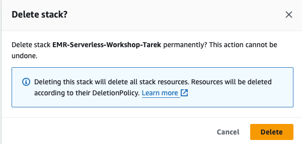

---

