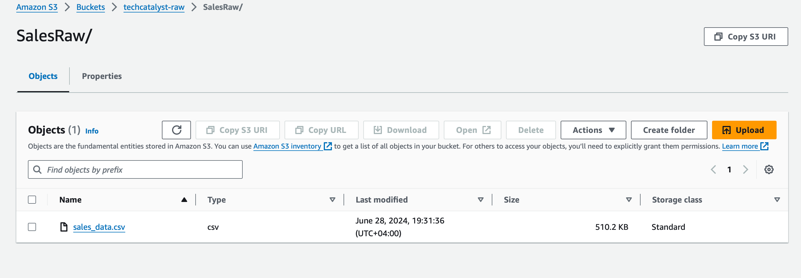
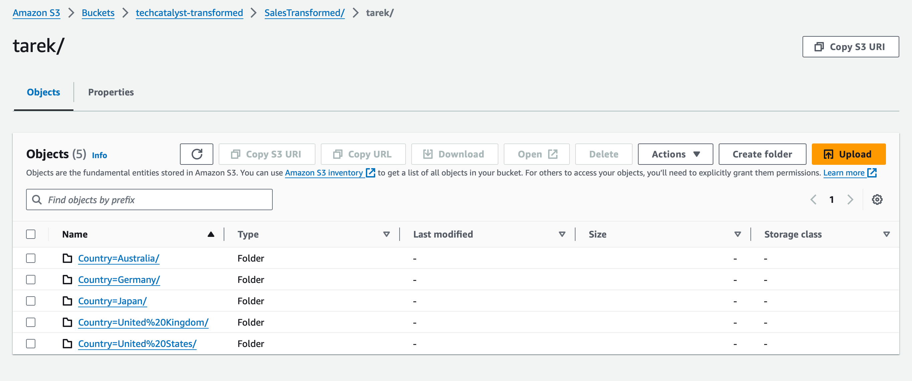

### Case Study: Cleaning and Transforming Sales Data

#### Case Study Description

In this case study, students will work with a dataset containing sales transactions across different countries and time zones. The dataset will include missing values, outliers, and data inconsistencies, providing a comprehensive exercise in data cleaning and transformation using Pandas.

**Columns in the dataset:**

- `DateTime`: The date and time of the sales transaction.
- `Time Zone`: The time zone of the sales transaction.
- `Sales Amount`: The amount of the sale.
- `Country`: The country where the sale was made (matching the time zone).
- `Sales Person`: The name of the salesperson who made the sale.

**Tasks:**

1. **Data Ingestion**: Load the data into a Pandas DataFrame.
2. **Data Cleaning**:
   - Identify and handle missing values in the `Sales Amount` column for example (blank, "None", "?").
     - Missing data can be replaced with the Sales Average 
       - Optional Challenge: If you want to challenge yourself try and replace the sales average by Country 
   - Identify and handle outliers in the `Sales Amount` column.
     - Columns that have values that are excessively high 
   - Round Sales data into 2 decimal for example it should look like: `XXXXX.XX `as in` 20000.00`
3. **Time Zone Conversion**:
   - Localize the `DateTime` column to the corresponding time zone. Store it into `DateTime_Localized`
   - Convert the `DateTime_Localized` column to UTC. Store it into `DateTime_UTC`
4. **Data Analysis**:
   - Calculate total sales for each country.
   - Calculate total sales for each salesperson.

**Instructions:**

1. **Data Ingestion**:
   - Load the data into a Pandas DataFrame.
   - The data is in a Private S3 bucket `s3://techcatalyst-raw/SalesRaw/sales_data.csv`

1. **Data Cleaning**:
   - Replace blank, "None", and "?" values in the `Sales Amount` column with `NaN`.
   - Convert the `Sales Amount` column to numeric, coercing errors.
   - Identify and handle outliers in the `Sales Amount` column (values excessively high).
2. **Time Zone Conversion**:
   - Localize the `DateTime` column to the corresponding time zone specified in the `Time Zone` column.
   - Convert the localized `DateTime` column to UTC.
3. **Data Analysis**:
   - Calculate the total sales for each country.
   - Calculate the total sales for each salesperson.
4. **Load**
   1. Load the transformed data into another Private S3 bucket inside the `SalesTransformed` folder : `s3://techcatalyst-transformed/SalesTransformed/`
   2. Make sure to add your name for example `s3://techcatalyst-transformed/SalesTransformed/tarek/`
   3. Partition the data by Country

