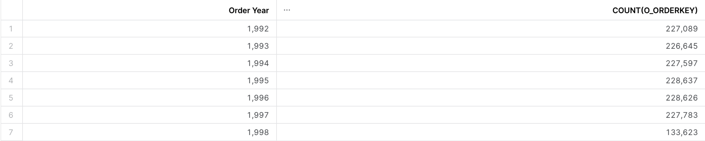
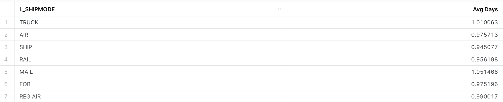
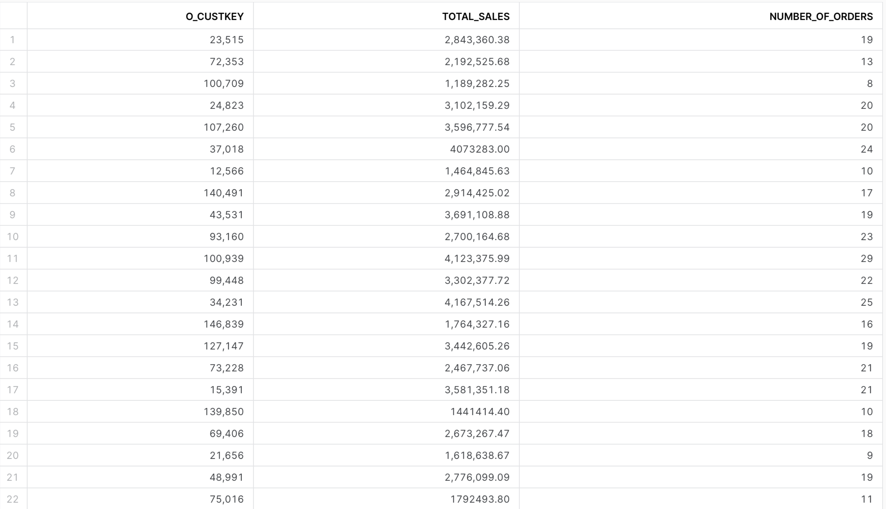

## 3.2.1 Activity

**Exercise 1: Count number of Orders by Year**

`ORDERS` table

**Exercise 2 Average Days by Ship Mode**

What is the average days from Commit Date to Ship Date broken by Ship Mode?

`LINEITEM` table

> Hint: https://docs.snowflake.com/en/sql-reference/functions/datediff

**Exercise 3 Total Sales and Number of Orders by Customer**

`ORDERS` table

