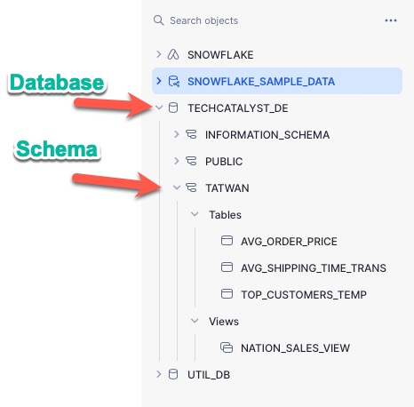
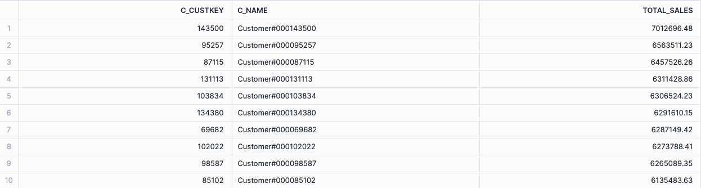
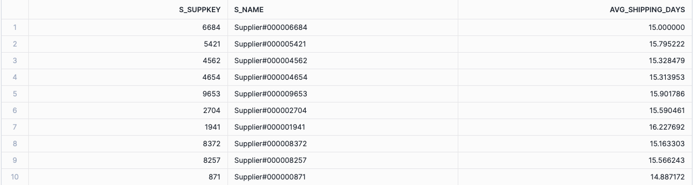
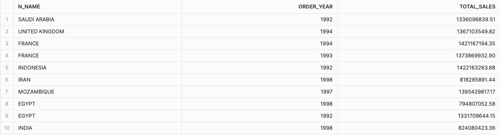

# 3.4.4

### Create you personal schema in `TECHCATALYST_DE` Database

```sql
CREATE SCHEMA IF NOT EXISTS techcatalyst_de.my_personal_schema;
USE SCHEMA techcatalyst_de.my_personal_schema;

```

Ensure all tables/views below have been created in your schema 

**Example**

```sql
Create schema techcatalyst_de.tatwan;
use schema techcatalyst_de.tatwan;
```




### Activity 1: Create a Temporary Table

**Task:** Write a query to find the top 10 customers by total sales and store the results in a temporary table.




### Activity 2: Create a Transient Table

**Task:** Write a query to find the average shipping time per supplier and store the results in a transient table.



### Activity 3: Create a View

**Task:** Write a query to find the total sales for each nation by year and store the results in a view.




### Activity 4: Create a Standard Table

**Task:** Write a query to find the average order price per market segment and store the results in a standard table.