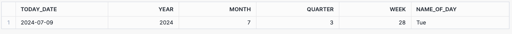
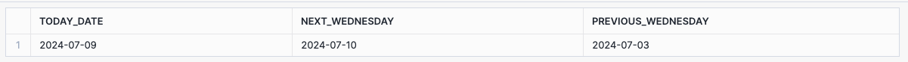
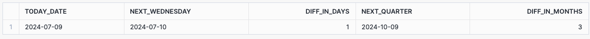
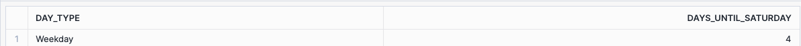

# Activities and Tutorials to Introduce Date and Time Functions, Conversion Functions, and Conditional Functions


#### Activity 1: Exploring Current Date and Time Components

**Objective**: Understand how to extract different components from the current date. **Instructions**:

1. Write a query to get today's date.
2. Extract the year, month, quarter, and week number from today's date.
3. Get the name of the day for today's date.



```sql
SELECT CURRENT_DATE() as TODAY_DATE,
-- ...CONTINUE
```

#### Activity 2: Finding Next and Previous Specific Days

**Objective**: Learn how to find the next and previous occurrences of a specific day. **Instructions**:

1. Write a query to find the next Wednesday from today's date.
2. Write a query to find the previous Wednesday from today's date.



```sql
SELECT CURRENT_DATE() as TODAY_DATE,
-- CONTINUE

```


#### Activity 3: Adding and Subtracting Dates

**Objective**: Learn how to manipulate dates by adding or subtracting time units. **Instructions**:

1. Write a query to add one month and one quarter to today's date.
2. Write a query to subtract one week and one year from today's date.


```sql
SELECT CURRENT_DATE() as TODAY_DATE,
-- CONTINUE

```

#### Activity 4: Calculating Date Differences

**Objective**: Understand how to calculate the difference between two dates. **Instructions**:

1. Write a query to find the difference in days between today and the next Wednesday.
2. Write a query to find the difference in months between today and the next quarter.



```sql
SELECT CURRENT_DATE() as TODAY_DATE,
-- CONTINUE

```

#### Activity 5: Converting Strings to Decimals and Dates

**TRY THESE**

**Objective**: Learn how to convert strings to different data types. **Instructions**:

1. Write a query to convert a string to a decimal using three different methods.
2. Write a query to convert a string to a date and a datetime using different functions.

```sql
SELECT
    CAST('124' as DECIMAL(5,2)) as decimal_cast,
    '124'::DECIMAL(5,2) as decimal_colon,
    TO_DECIMAL('124', 5,2) as decimal_to,
    TRY_TO_DECIMAL('12A', 5,2) as decimal_try,
    CAST('2023-10-25' as DATE) as date_cast,
    '2023-10-25'::DATE as date_colon,
    TO_DATE('2023-10-25') as date_to,
    CAST('2023-10-25' as DATETIME) as datetime_cast,
    '2023-10-25'::DATETIME as datetime_colon,
    TO_TIMESTAMP('2023-10-25') as datetime_to;
```


#### Activity 6: Handling Invalid Data in Conversions

**TRY THESE**

**Objective**: Learn how to handle invalid data during conversions. **Instructions**:

1. Write a query to convert invalid strings to dates and decimals, ensuring the query does not fail.
2. Use `TRY_CAST` and `TRY_TO_DATE` functions to handle invalid data.

```sql
SELECT
    TRY_CAST('202A-10-25' as DATE) as try_date_cast,
    TRY_CAST('202A-10-25' as DATETIME) as try_datetime_cast,
    TRY_TO_DATE('202A-10-25') as try_date_to,
    TRY_TO_TIMESTAMP('202A-10-25') as try_datetime_to,
    TRY_TO_DECIMAL('12A', 5,2) as try_decimal_to;

```

#### Activity 7: Using IFF for Conditional Logic

**Objective**: Understand how to apply conditional logic in SQL using the `IFF` function. **Instructions**:

1. Write a query to determine if a number is positive, negative, or zero using the `IFF` function. Use the number `5` for the first column
2. Write a query to label a number as "Even" or "Odd". Use the number `4` for the second column.


```sql


```

#### Activity 8: Combining Date and Time Functions with Conditional Logic

**Objective**: Combine date functions with conditional logic to create complex queries. **Instructions**:

1. Write a query to find if today's date is a weekday or weekend using `IFF` and `DAYNAME`.
2. Write a query to find the number of days until the next Saturday.
   1. HINT:  Look into`NEXT_DAY(CURRENT_DATE(), 'SA')` . What does it do?
   2. HINT: You will need to use `DATEDIFF`  




```sql


```


